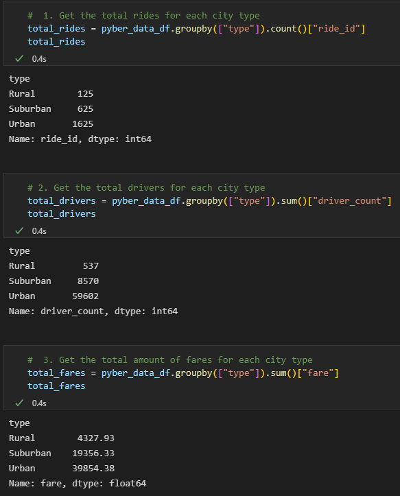
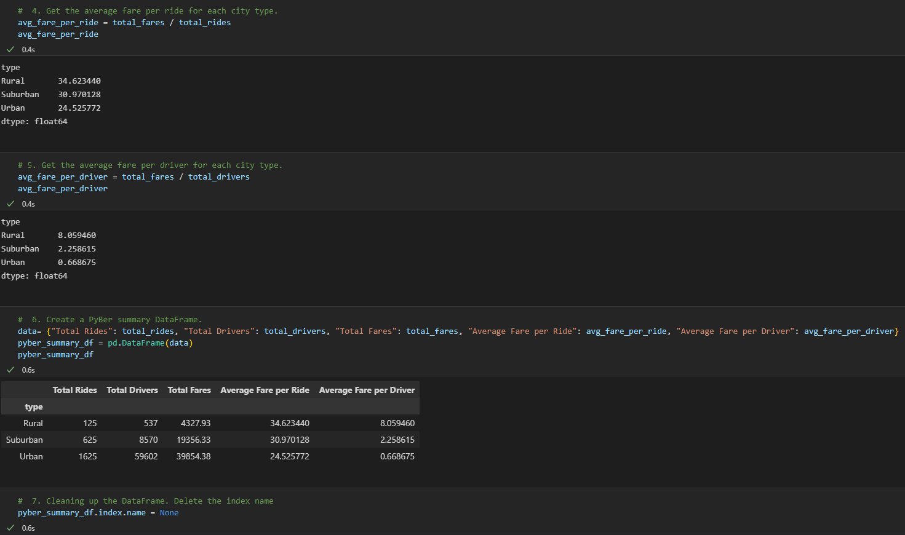
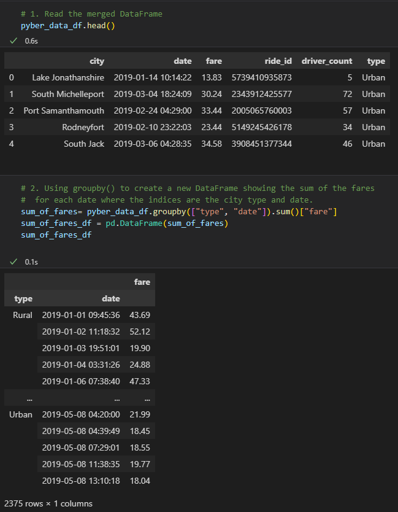
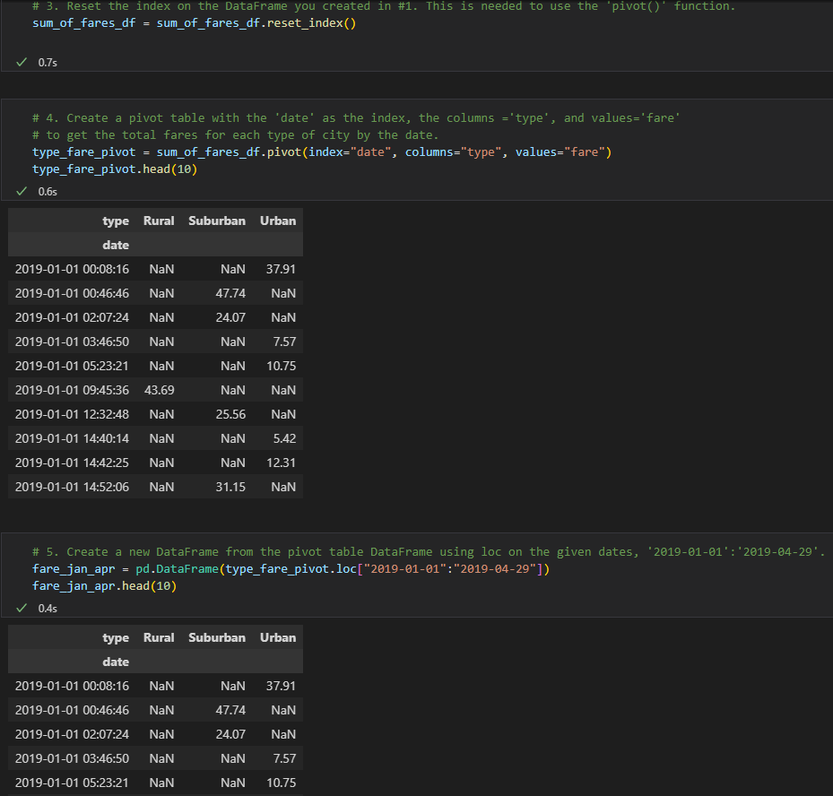
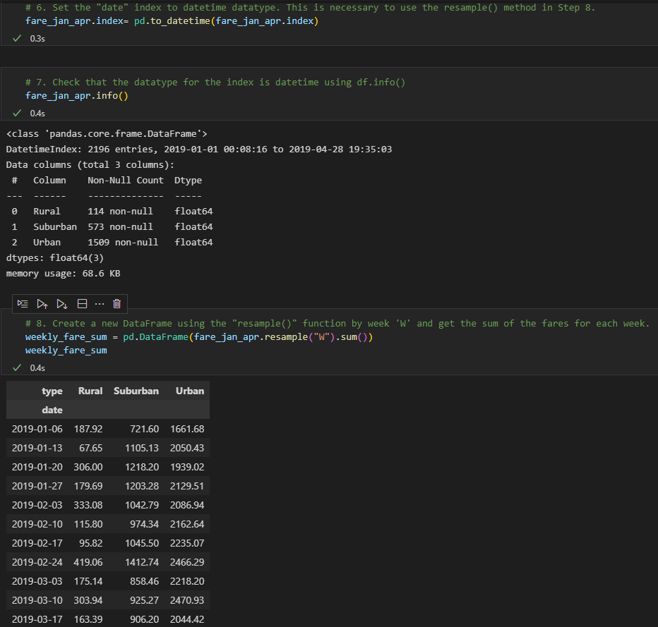
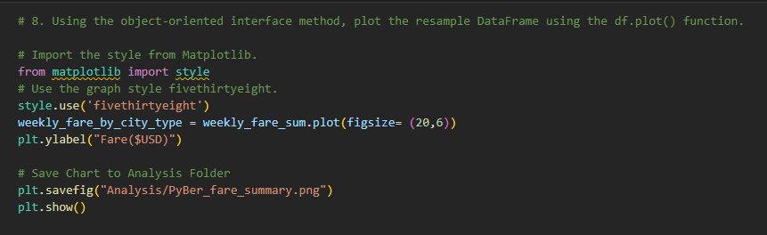
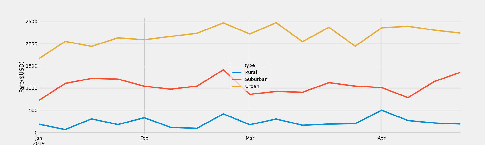

# PyBer_Analysis

## Overview of Analysis Challenge
The purpose of this analysis challenge was to better our skills in DataFrames, by using functions such as groupby, pivot, and plots. Using these skilled helped us to clean the data to see the the average fare per driver and ride for the three city types (Rural, Suburban, and Urban). We then went on to break it down into a line chart that showed the avg. weekly fare for the three city types. 
## Results
### Deliverable 1
In Deliverable 1, we extracted the information we needed for the analysis by using the groupby, sum, and count functions as shown below. We then created a DataFrame to clearly see the data for Rural, Suburban, and Urban cities. From the data we found that in Urban cities the average fare per person was roughly $7.50 less than the Rural cities. 

.
.
.
### Deliverable 2
In Deliverable 2, we grouped by type and date so we could see how much the fare was in the city type on a certain date. We then used the pivot function to get the city type's as columns and set the index to date. After that, we used the loc function to only show data from 1-1-2019 - 4-29-2019. To go even further, we resampled the data to break it down into average weekly fare by city type. Finally, we plotted the data as a line graph to see the data most clearly. From this data, we found out that there is a lot more money being spent on fare's in Urban cities verses Rural cities.

.
.
.
.
## Summary
.
According to the graph, the urban cities are clearly spending more on transportation than Rural and Suburban cities. This is most likely because there is more options for fare's in Urban areas rather than Rural and Suburban cities. An option would be to raise the price of fare's in Suburban and Rural cities, but then you take the risk of people not using that transportation method anymore. Also, another suggestion would be to make more fare type options in Rural and Suburban cities, but again you are taking a risk because more people in these types of areas have thier own vehicles. Unless you can take personal vehicles away from people, this is how it will be. More people bring more opportunity for fare types. When people are spread out, it is harder to bring them transporation methods other than them driving themselves. 
